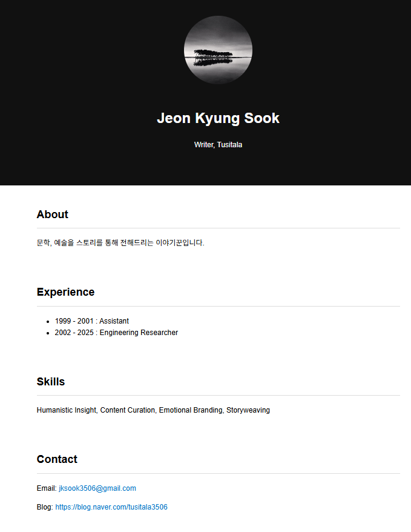
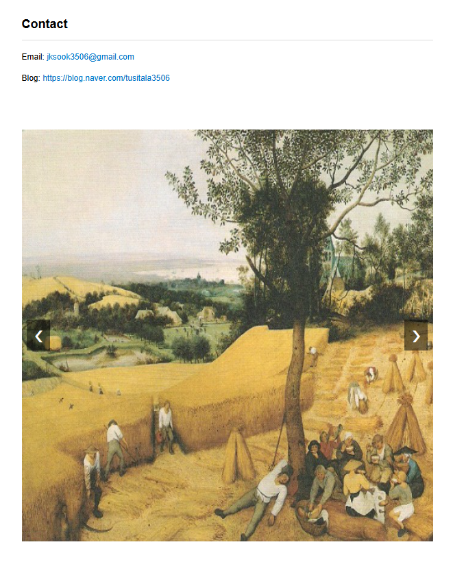

# 웹 명함 프로젝트 (Web Name Card)

---

## 1. 개요

이 프로젝트는 **웹 명함(프로필 페이지)** 형태의 웹사이트입니다.  
한 페이지에서 소개, 경력, 스킬, 연락처를 보여 주고, **이미지 슬라이드쇼** 기능이 포함되어 있습니다.

- **주요 페이지**: `index.html` — 프로필 사진, About, Experience, Skills, Contact, 이미지 슬라이드
- **참고용 페이지**: `webnamecard.html` — 기본 명함 레이아웃 예시(홍길동 템플릿)
- **스타일**: `style.css` — 전체 레이아웃·슬라이드·반응형 스타일
- **동작**: `script.js` — 슬라이드 이전/다음 버튼, 5초 자동 슬라이드

개발 도구 없이 **웹 브라우저만** 있으면 실행할 수 있습니다.

---

## 2. 폴더 구조

프로젝트 루트 폴더 기준으로 파일이 다음과 같이 배치되어 있습니다.

```
vibe-coding/
├── index.html          ← 메인 명함 페이지 (실행할 파일)
├── webnamecard.html    ← 참고용 명함 템플릿
├── style.css           ← 스타일 시트
├── script.js           ← 슬라이드 등 동작 스크립트
├── 사진_전경숙.jpeg    ← 프로필 사진 (index.html에서 사용)
├── image1.jpeg         ← 슬라이드 이미지 1
├── image2.jpeg         ← 슬라이드 이미지 2
├── image3.jpeg         ← 슬라이드 이미지 3
├── README.md           ← 이 문서
└── .vscode/            ← 에디터 설정 (선택)
    └── settings.json
```

> **참고**: `index.html`과 같은 폴더에 `style.css`, `script.js`, 이미지 파일들이 있어야 정상적으로 표시됩니다.

---

## 3. 실행 방법

코드를 수정하지 않고 **그대로 실행**하는 방법입니다.

### 방법 A: 파일 더블클릭으로 열기

1. **프로젝트 폴더**를 엽니다. (예: `vibe-coding` 폴더)
2. **`index.html`** 파일을 찾습니다.
3. **`index.html`**을 **더블클릭**합니다.
4. 기본 웹 브라우저(Chrome, Edge, Firefox 등)에서 명함 페이지가 열립니다.

### 방법 B: 브라우저에서 파일 열기

1. 웹 브라우저(Chrome, Edge, Firefox 등)를 실행합니다.
2. **Ctrl + O** (Mac: **Cmd + O**)를 눌러 "파일 열기" 창을 띄웁니다.
3. 프로젝트 폴더로 이동한 뒤 **`index.html`**을 선택하고 **열기**를 클릭합니다.
4. 명함 페이지가 표시됩니다.

### 방법 C: Live Server 등 로컬 서버 사용 (선택)

- VS Code에서 **Live Server** 확장을 설치한 경우:
  1. `index.html`을 연 뒤 편집기에서 **우클릭** → **Open with Live Server**를 선택하면 브라우저에서 자동으로 열립니다.

---

## 4. 주요 구성 파일

### 4.1 index.html

- **역할**: 메인 **웹 명함 페이지**입니다.
- **구성**:
  - **head**: 문자 인코딩(UTF-8), 뷰포트, 제목, `style.css` 링크
  - **header**: 프로필 이미지(`사진_전경숙.jpeg`), 이름, 직함
  - **section**: About, Experience, Skills, Contact
  - **슬라이드 섹션**: 이전/다음 버튼, `image1.jpeg` ~ `image3.jpeg` 슬라이드
  - **script**: 페이지 하단에서 `script.js` 로드

이미지 파일명(`사진_전경숙.jpeg`, `image1.jpeg` 등)을 바꾸면 HTML 안의 `src` 값도 같은 이름으로 맞춰 주어야 합니다.

---

### 4.2 script.js

- **역할**: 슬라이드쇼 **이전/다음 버튼**과 **5초 자동 슬라이드**를 처리합니다.
- **동작 요약**:
  - `slideTrack`: 슬라이드 이미지들이 나란히 있는 컨테이너
  - `slides`: 각 슬라이드 이미지 요소들
  - `currentIndex`: 현재 보이는 슬라이드 번호 (0부터 시작)
  - `totalSlides`: 슬라이드 개수
  - `updateSlide()`: `slideTrack`을 `translateX`로 이동해 `currentIndex`번째 이미지가 보이게 함
  - `nextSlide()`: 다음 슬라이드로 이동 (마지막이면 처음으로)
  - `prevSlide()`: 이전 슬라이드로 이동 (처음이면 마지막으로)
  - `resetAutoSlide()`: 버튼 클릭 시 자동 슬라이드 타이머를 초기화하고 다시 5초 간격으로 설정

변수·함수명은 `slideTrack`, `currentIndex`, `updateSlide`처럼 **camelCase**로 사용됩니다.

---

### 4.3 style.css

- **역할**: 페이지 전체 **레이아웃·색상·슬라이드·버튼** 스타일을 정의합니다.
- **주요 내용**:
  - `body`, `header`, `section`: 기본 여백, 폰트, 헤더 배경색
  - `h2`: 섹션 제목 밑줄
  - `.slideSection`, `.slideContainer`, `.slideTrack`, `.slideImage`: 슬라이드 영역과 이미지 배치
  - `.slideBtn`, `.prevBtn`, `.nextBtn`: 좌우 화살표 버튼 위치·스타일
  - `.profileImage`: 프로필 사진 크기(150px), 원형(`border-radius: 50%`)
  - `@media (max-width: 600px)`: 작은 화면에서 헤더 패딩 조절

---

### 4.4 webnamecard.html

- **역할**: **참고용** 웹 명함 템플릿입니다. (홍길동 예시)
- **특징**: 스타일이 HTML 안 `<style>` 태그로 들어 있어, `style.css` 없이도 열 수 있습니다.  
  메인 명함은 `index.html`을 사용하면 됩니다.

---

## 5. 결과 예시

아래 빈칸에 **실행 후 화면을 캡처한 스크린샷**을 넣을 수 있습니다.

### 5.1 메인 명함 화면 (index.html)

| 구역 | 설명 |
|------|------|
| **스크린샷** | *()* |

**캡처 방법 예시**  
1. `index.html`을 브라우저로 연다.  
2. **전체 페이지** 또는 **보이는 영역**을 캡처한다. (Windows: **Win + Shift + S**, Mac: **Cmd + Shift + 4** 등)  
3. 이 README.md가 있는 폴더에 이미지 파일(예: `screenshot.png`)로 저장한 뒤, 아래처럼 마크다운으로 넣을 수 있다.

```markdown

```

---

### 5.2 슬라이드 영역

| 구역 | 설명 |
|------|------|
| **스크린샷** | *()* |

---

*이 문서는 프로젝트 폴더 구조와 코드를 바탕으로 작성되었으며, 개발자가 아닌 분도 단계별로 따라 실행할 수 있도록 구성했습니다.*
